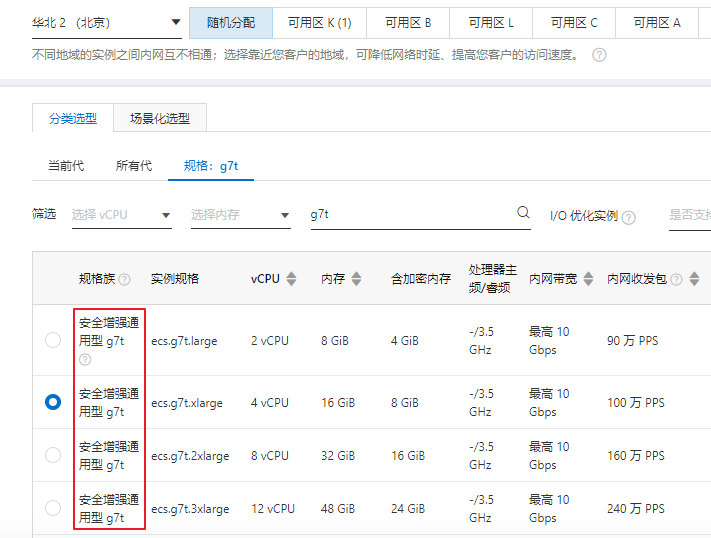
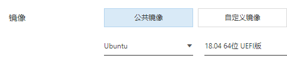
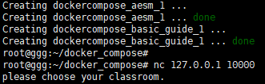
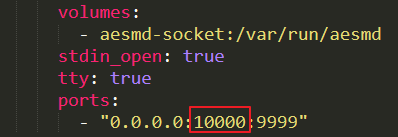
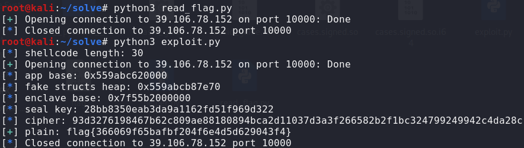
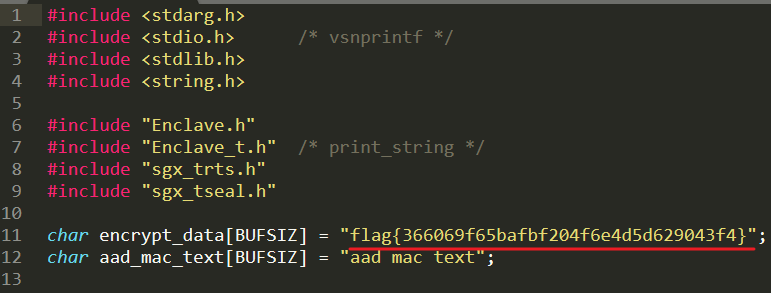

### 题目名称

Basic Guide

### 题目描述

Do you still remember the joy of `cat /flag` for the first time? In order to help you get back your original intention of solving pwn challenges, I built a cyber range for getting started with pwn learning. Have fun!

### hint

1. You need to find out how to get the seal key.
1. https://www.usenix.org/conference/usenixsecurity18/presentation/biondo

### 部署方法

需要**阿里云**安全增强通用型 g7t 规格的服务器

操作系统为 Ubuntu 18.04 UEFI 版

服务器启动后将 `docker_compose` 文件夹复制到服务器中，并为 `sgx_intsall.sh` 及`build_compose_run.sh` 文件添加可执行权限

确保工作目录为 docker-compose，执行 `sgx_install.sh`

cd 到 change_flag 目录执行 `./app && cp /flag ../bin/flag`

回到 docker-compose，执行 `build_compose_run.sh`，等待其运行结束即可 nc 127.0.0.1 10000 测试

如欲修改外部端口需要修改 docker-compose.yml，将其中的 10000 修改为指定端口

### 解题方法

理论层面参照论文 `paper\The Guard's dilemma_efficient code-reuse attacks against intel sgx.pdf`

linux 下，在 `scripts` 目录首先运行 `python3 read_flag.py`（修改 remote 连接的 ip 和端口），当前目录下会出现一个 flag 文件，再运行 `python3 exploit.py` （修改 remote 连接的 ip 和端口）稍等片刻会输出 flag

### Flag 更改方式

修改 `docker_compose\change_flag\Enclave\Enclave.cpp` 中第 11 行的 encrypt_data 内容：

在 `docker_compose\change_flag` 目录执行 `make clean && make && rm /flag && ./app`

再执行 `docker cp /flag <container_id>:/flag` 将修改后的 flag 推送到容器内

