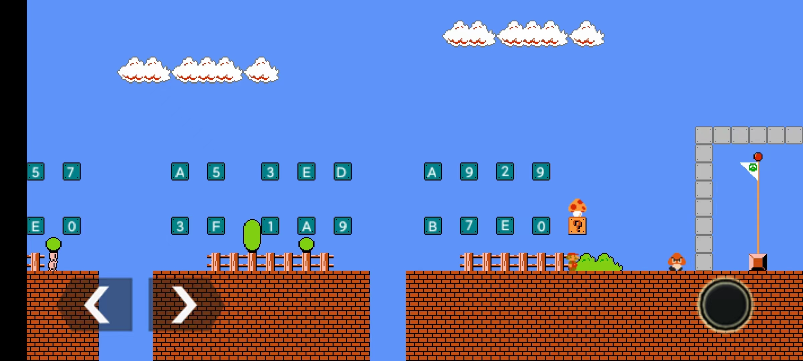
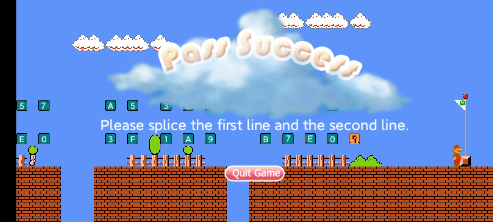

### 题目名称

Super Flagio

### 题目描述

[flagio] "I can see the flag!"
\<system> A wild Goomca has appeared!
[Goomca] "Try your best to beat me! Ahhhh!!!"
[flagio] "I have to find the mushroom to gain more power. But how can I solve this puzzle?"

### hint

1. Figure out how the scripts in `src` are loaded.
2. Maybe you need to find a disassembly/decompiler tool for luajit64.
3. Pay attention to how the luajit vm is implemented.

### 解题方法

详细 wp 见 [blog](https://in1t.top/2023/04/02/7th-XCTF-Final-Super-Flagio/)。

解题脚本（`scripts/solve.py`）：

```python
cipher = [ 94, 106, 91, 110, 86, 100, 82, 20, 32, 20, 80, 21, 83, 107, 88, 98, 81, 19, 79, 10, 49, 117, 68, 120, 61, 13, 75, 115, 48, 8, 76, 123 ]

for i in range(31, 0, -1):
	if i % 2 == 0 or i == 31:
		cipher[i] += 1
	else:
		cipher[i] -= 1
	cipher[i] &= 0xFF
	cipher[i] ^= cipher[i - 1]

cipher[0] = (cipher[0] + 1) ^ 30

flag = ''.join(map(chr, cipher))
print(flag)
# A766957A53EDA9290CCF8E03F1A9B7E0
```

在游戏里去顶砖块（上面一排是前 16 个字符，下面一排是后 16 个字符），最后再顶问号块，可以得到蘑菇



吃了蘑菇去碰板栗，墙就会消失，触碰旗帜通关成功




